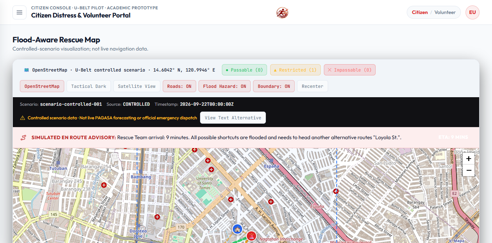
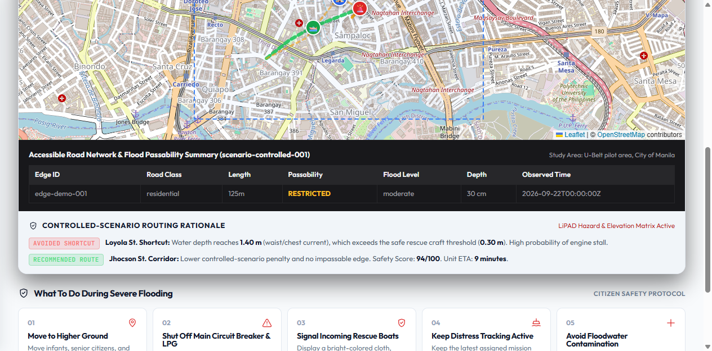

# Team Phase 1 map acceptance evidence

**Feature owner:** Elle (`@Qiuyuan26`)

**Acceptance owner:** Ranee (`@seavens3nt`)

**Scope:** Issue #34 fixture-driven road and controlled-flood map layers

**Verified baseline:** Team Phase 1 gate branch after PRs #39–#43 merged

**Verified:** 2026-10-02

## Current acceptance result

The frontend consumes the checked-in files below directly through the map-data adapter:

- `data/samples/ubelt-v1-preview.geojson`
- `data/samples/ubelt-v1-flood-join.geojson`
- `data/samples/study-area.geojson`

The adapter rejects malformed geometry, out-of-bound coordinates, duplicate edge IDs, unsupported live-source labels, and mismatched study-area IDs. It preserves GeoJSON `[longitude, latitude]` input and converts it to Leaflet `[latitude, longitude]` only at the rendering boundary.

The component exposes deterministic success, loading, empty, malformed, and unavailable states. Its visible metadata identifies the controlled or historical scenario, includes its source timestamp, and says that the data is not live PAGASA forecasting or official emergency dispatch.

## Visual evidence

The screenshots were captured from the local production-compatible Vite application using the checked-in sample fixtures.





Screenshots support visual review only. The repeatable automated checks below remain the authoritative functional evidence.

## Reproducible checks

From `frontend`:

```powershell
npm ci
npm run lint
npm test -- --run
npm run build
```

Final integrated results on 2026-10-03:

- lint completed with no errors and four pre-existing warnings outside the Team Phase 1 map package;
- `14` test files and `155` tests passed;
- the TypeScript and Vite production build passed; and
- browser verification found meaningful content, no Vite error overlay, visible non-live labeling, working Hazard Map navigation, and a working accessible text alternative.

The map tests read the authoritative repository fixtures instead of copying
their coordinates into React components. They verify the 30 road edges, 10
controlled records, `ubelt-v1` identifiers, nullable source timestamps, joins,
boundary validation, and truthful non-live metadata.

## Dependency boundary

Issue #32 is the accepted source of the bounded U-Belt road graph and
controlled-flood join. Ranee reran the frontend checks after PR #39 reached
`main` and corrected the default imports to consume those accepted fixtures.

No live forecast, guaranteed-safe route, government integration, or operational emergency-readiness claim is made.
